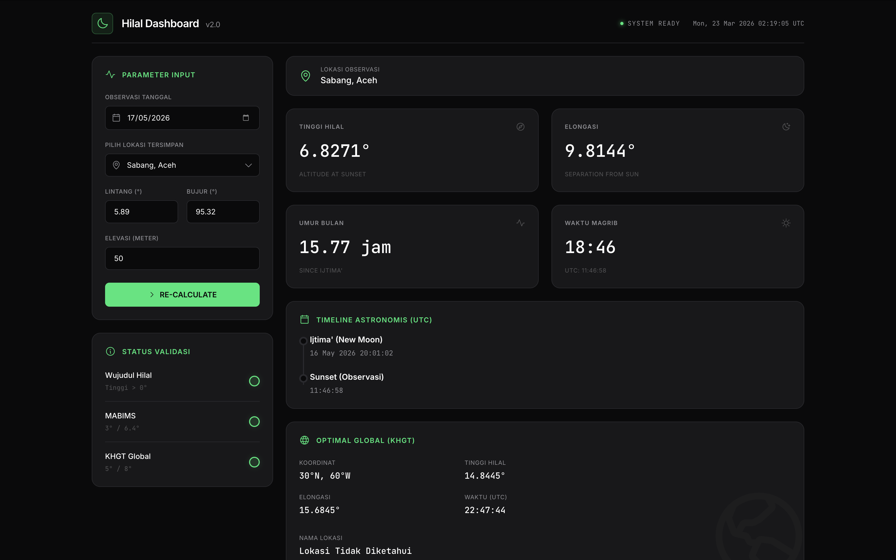

# CalHilal Global Dashboard 🌙

A beautiful, responsive, dark-themed web dashboard for astronomical Hilal (New Moon) calculations. Built to support multiple local and global crescent visibility criteria validation (Wujudul Hilal, MABIMS, and KHGT Global).



## ✨ Features

- **Accurate Astronomical Engine**: Built natively on top of Python's powerful `Skyfield` package to calculate New Moon (Ijtima'), Sunset (Magrib), Moon Altitude, and angular Elongation with extreme precision.
- **Multi-Criteria Validation**: Automatically validates crescent visibility against three standard thresholds:
  - **Wujudul Hilal** *(Altitude > 0°)*
  - **MABIMS** *(Altitude ≥ 3° / Elongation ≥ 6.4°)*
  - **KHGT Global** *(Altitude ≥ 5° / Elongation ≥ 8°)*
- **Global Optimal Search (KHGT)**: Computationally scans latitudes/longitudes across the globe to identify the optimal location where Hilal visibility is highest natively at Sunset.
- **Smart Reverse Geocoding**: Automatically translates calculated coordinates into human-readable locations (e.g. City, Country) using OpenStreetMap's free Nominatim API.
- **Interactive Dark Map**: Integrated `Leaflet.js` mapping using CartoDB Dark-Matter tiles to visually pin the optimal global coordinate directly natively on the dashboard.
- **Premium User Interface**: Modern, component-based vanilla HTML/CSS layout focusing on strict dark-mode aesthetics, custom native form elements, and smooth interactions without heavy frontend frameworks.

## 🚀 Setup & Installation

**Prerequisites:** Python 3.8+ and internet connection (required for map tiles and reverse geocoding API).

### 1. Install Dependencies

You'll need a few python packages installed. Open your terminal inside this directory and run:

```bash
pip install flask skyfield pytz
```
*Note: Make sure your environment has permission to read/write the local `de421.bsp` ephemeris file which Skyfield downloads on first launch.*

### 2. Start the Server

Run the Flask application via terminal:

```bash
python app.py
```

### 3. Use the Dashboard

Open your favorite web browser and navigate directly to:  
**[http://127.0.0.1:5001](http://127.0.0.1:5001)**

## 🛠️ Modifying Presets

You can add or modify the saved location shortcuts (e.g., `Sabang`, `Sleman`) directly inside `templates/index.html` by searching for `<select id="preset-location">`.

---

*Built manually to automate accurate Multi-criteria Islamic Astronomical Calculations.*
